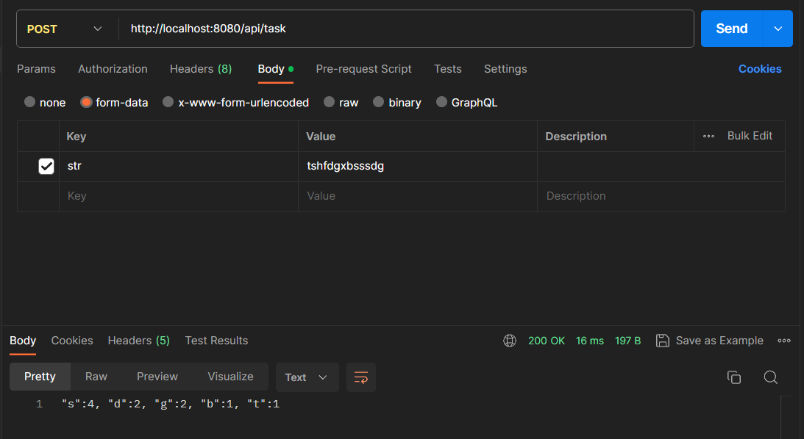

# Частота встречи символов по заданной строке.

## Описание

Спроектировать(продумать формат и ограничения входящих/исходящих параметров) и реализовать REST API, вычисляющее частоту
встречи символов по заданной строке. Результат должен быть отсортирован по убыванию количества вхождений символа в
заданную строку.

****Пример** входной строки**: “aaaaabcccc”

**Пример выходного результата**: “a”: 5, “c”: 4, “b”: 1

## Технологии

* Java 17+
* Spring boot 3.1.4
* Spring boot starter test

## Файл настроек

В `src/main/resources/application.properties` присудствуют 2 параметра:

* `server.limit.request` - ограничения входящих параметров
* `server.limit.response` - ограничения исходящих параметров

Если не указывать данные параметры, то программа задаст максимальное возможное значение(`Integer.MAX_VALUE`).

## Запуск приложения

1. Скачайте и скомпилируйте исходный код приложения, если это необходимо.

1. Перейдите в каталог, содержащий файл JAR(`target/TestTask-1.jar`).

1. Откройте командную строку (терминал) и выполните следующую команду для запуска приложения:
   `java -jar TestTask-1.jar`

При успешном запуске, приложение будет доступно по адресу http://localhost:8080 в вашем веб-браузере.

## Формат входящих/исходящих параметров

### 'Post `/api/task`'

#### Формат входящих параметров

Входная строка

* Тип данных: String
* Описание: Строка, в которой вы хотите подсчитать повторяющиеся символы.
* Пример входной строки: "aaaaabcccc"

####   Формат исходящих параметров

  Выходной результат
*  Тип данных: String
*  Описание: строка, содержащая информацию о количестве повторяющихся символов во входной строке. 
Результат отсортирован по убыванию количества вхождений символа в заданную строку.

